# mahler

`mahler` is a library and engine for automatic orchestration of jobs into executable workflows.

[](https://crates.io/crates/mahler)
[](https://docs.rs/mahler)

More information about this crate can be found in the [crate documentation](https://docs.rs/mahler/latest/mahler/).

> [!WARNING]  
> This project is still quite experimental, while the API is reaching a relatively stable state, it may still be subjected to change.
> Same thing with the internal planning and execution model, it is very much still in a _make it work_ stage and there are still
> a lot of optimizations that can be made.

## Overview

Modern infrastructure requires intelligent automation that can adapt to changing conditions. Traditional static workflows become unmanageable as system complexity grows - you end up with brittle scripts that break when conditions change.

Mahler solves this by using [automated planning](https://en.wikipedia.org/wiki/Automated_planning_and_scheduling) to generate workflows dynamically. Instead of writing complex conditional logic, in Mahler, tasks are defined via simple Rust functions. The planner automatically discovers the right sequence of operations to reach a desired target state.

## Core Features

- **Simple API** - system state is defined as Rust structs with the help of the provided [derive](https://crates.io/crates/mahler-derive) crate.
  Allowed tasks are defined as pure Rust functions acting on a part or the whole system state.
- **State engine with integrated planner** - tasks are configured as jobs in a `Worker` domain. On a new target state, the worker will look for necessary changes to reach the target and look for a workflow that allows to reach the target from the current state.
- **Concurrent execution** - the internal planner detects when tasks can run concurrently based on state paths
- **Automatic re-planning** - re-computes workflow when runtime conditions change
- **Observable runtime** - monitor the evolving state of the system from the Worker API. For more detailed logging, the library uses the [tracing crate](https://crates.io/crates/tracing).
- **Easy to debug** - worker observable state and known goals allow easy replicability when issues occur.

## Basic Usage

In Mahler, a **Task** is an operation on a part of the system state that may chose to make changes given some target. It is defined as a pure Rust function. A **Job** is the configuration of the task to an operation on an operation on the system state. For instance a **task** may be "increment counter", but the **job** defines "use the 'increment counter' task for every counter that requires an update operation to reach the target".

This separation lets the planner compose your jobs into workflows that achieve complex state transitions. Jobs are evaluated during planning to determine applicability to a given target and later executed at runtime.

We'll create a system controller for a simple counting system. Let's define a task that operates on i32

```rust
use std::time::Duration;
use tokio::time::sleep;

use mahler::task::{IO, with_io};
use mahler::extract::{Target, View};

// `plus_one` defines a task that updates a counter if it is below some target.
// The task makes use of two extractors:
// - `View`, that provides a mutable view into the system state. By modifying the view,
// the task can affect the global state
// - `Target`, providing a read only view to the target being seeked by the planner
fn plus_one(mut counter: View<i32>, Target(tgt): Target<i32>) -> IO<i32> {
    if *counter < tgt {
        // Modify the counter value if we are below the target
        *counter += 1;
    }

    // This task is called at planning and at runtime, the `with_io` function
    // allows us to define what is returned by the function at each context.
    // The first argument of the function is what the planner receives,
    // the right side of the call is what will be executed at runtime if the
    // task is selected.
    with_io(counter, |counter| async {
        // The async call can be used to actually make changes to the underlying system.
        // It could be writing the counter to a database or a file. In this
        // case we just add some timer
        sleep(Duration::from_millis(10)).await;
        Ok(counter)
    })
}
```

The task above updates the counter if it is below the target, otherwise it returns the same value that it currently has. When planning, a task that performs no changes on the system state is not selected, which allows us to control when the task is considered applicable.

The function above defines an atomic task (also called an action), but we can also define compound tasks (also called methods), that allow to bias the planner to certain workflows depending on the conditions. Let's define a task to increase the counter by `two`.

```rust
use mahler::task::Handler;
use mahler::extract::{Target, View};

// `plus_two` is a compound task or method. A method does not modify the state directly
// but return combination of tasks to be executed to reach the given target.
fn plus_two(counter: View<i32>, Target(tgt): Target<i32>) -> Vec<Task> {
    // If the difference between the current state and target is >1
    if tgt - *counter > 1 {
        // Then return a sequence of two tasks with the same target
        return vec![plus_one.with_target(tgt), plus_one.with_target(tgt)];
    }

    // Otherwise do nothing
    vec![]
}
```

To use the tasks, we need to create a system model where the tasks will be applied. We'll use
a Map.

```rust
use mahler::state::{Map, State};

// The `State` macro allows to models the system in a way that
// can evaluated by Mahler
#[derive(State, Debug, PartialEq, Eq)]
struct Counters(Map<String, i32>);
```

Finally in order to create and run workflows we need a `Worker`

```rust
use mahler::worker::Worker;
use mahler::job::update;

let mut worker = Worker::new()
    // try the task `plus_one` if an `update` operation on a counter is required
    // to reach the target state
    .job("/{counter}", update(plus_one))
    // try the task `plus_two` if an `update` operation on a counter is required
    // to reach the target state
    .job("/{counter}", update(plus_two))
    .initial_state(Counters(Map::from([
        ("a".to_string(), 0),
        ("b".to_string(), 0),
    ])))
    .unwrap();

worker.seek_target(CountersTarget(Map::from([
    ("a".to_string(), 1),
    ("b".to_string(), 2),
])))
.await?;

println!("Final state: {:?}", worker.state().await?);
```

Note that `plus_one` and `plus_two` are configured as jobs to `update` operations to a counter, referenced by the route `/{counter}`.
This means that, when receving a new target, the worker will compare the current state with the target and convert it to a set of operations: `update`, `create`, `delete`, on specific paths of the state, and consider `plus_one` and `plus_two` as candidates whenever a update operation to a counter is required.

### Complete Example

Here's the full runnable example with logging and error handling:

```rust
use tracing_subscriber::{fmt, layer::SubscriberExt, util::SubscriberInitExt, EnvFilter};

use mahler::state::{Map, State};
use mahler::worker::Worker;
use mahler::task::{Handler, IO, with_io};
use mahler::job::update;
use mahler::extract::Args;
use mahler::result::Result;

#[tokio::main]
async fn main() -> Result<()> {
    // Initialize structured logging with tracing-subscriber
    // This provides human-readable logs for workflow execution monitoring
    tracing_subscriber::registry()
        .with(EnvFilter::from_default_env())
        .with(
            fmt::layer()
                .with_span_events(FmtSpan::CLOSE)
                .event_format(fmt::format().compact().with_target(false)),
        )
        .init();

    let mut worker = Worker::new()
        // The  jobs are applicable to `update` operations
        // on individual counters
        .job(
            "/{counter}",
            update(plus_one)
                // we can add a description to the job for the logs
                .with_description(|Args(counter): Args<String>| format!("{counter}++")),
        )
        .job("/{counter}", update(plus_two))
        // We initialize the worker with two counters
        // `a` and `b` with value 0
        .initial_state(Counters(Map::from([
            ("a".to_string(), 0),
            ("b".to_string(), 0),
        ])))?;

    // Tell the worker to find a plan from the initial state (a:0, b:0)
    // to the target state (a:1, b:2) and execute it
    worker
        .seek_target(CountersTarget(Map::from([
            ("a".to_string(), 1),
            ("b".to_string(), 2),
        ])))
        .await?;

    // Get the internal state from the Worker. The worker
    // is idle but the state may not be static so we need
    // to use an await to get the current state.
    let state = worker.state().await?;

    assert_eq!(
        state,
        Counters(Map::from([("a".to_string(), 1), ("b".to_string(), 2),]))
    );

    println!("The system state is now {:?}", state);
    Ok(())
}
```

When receiving a call to `seek_target`, the worker looks for a plan to get the system to the given target state. The plan can be seen in the logs further down, but its representation is

```
+ ~ - a++
  ~ - b++
- b++
```

which is equivalent to the following graph

```mermaid
graph TD
    start(( ))
    fork(( ))
    start --> fork
    a0(a++)
    fork --> a0
    fork --> b0
    b0(b++)
    join(( ))
    a0 --> join
    b0 --> join
    b1(b++)
    join --> b1
    stop(( ))
    b1 --> stop
    start:::initial
    stop:::finish
    classDef initial stroke:#000,fill:#fff
    classDef finish stroke:#000,fill:#000
```



The full logs generated by the worker are below.

```sh
> RUST_LOG=debug cargo run
    Finished `dev` profile [unoptimized + debuginfo] target(s) in 1.74s
     Running `target/debug/mahler-examples-readme`
2025-07-23T19:55:39.163508Z  INFO seek_target: applying target state
2025-07-23T19:55:39.163574Z  INFO seek_target: searching workflow
2025-07-23T19:55:39.163662Z DEBUG seek_target: pending changes:
2025-07-23T19:55:39.163672Z DEBUG seek_target: - {"op":"replace","path":"/a","value":1}
2025-07-23T19:55:39.163706Z DEBUG seek_target: - {"op":"replace","path":"/b","value":2}
2025-07-23T19:55:39.163858Z  INFO seek_target: workflow found time=276.708µs
2025-07-23T19:55:39.163871Z DEBUG seek_target: will execute the following tasks:
2025-07-23T19:55:39.163894Z DEBUG seek_target: + ~ - a++
2025-07-23T19:55:39.163900Z DEBUG seek_target:   ~ - b++
2025-07-23T19:55:39.163905Z DEBUG seek_target: - b++
2025-07-23T19:55:39.163911Z  INFO seek_target: executing workflow
2025-07-23T19:55:39.163938Z  INFO seek_target:run_task: starting task=a++
2025-07-23T19:55:39.163976Z  INFO seek_target:run_task: starting task=b++
2025-07-23T19:55:39.177845Z  INFO seek_target:run_task: close time.busy=55.8µs time.idle=13.8ms task=a++
2025-07-23T19:55:39.177908Z  INFO seek_target:run_task: close time.busy=22.8µs time.idle=13.9ms task=b++
2025-07-23T19:55:39.178029Z  INFO seek_target:run_task: starting task=b++
2025-07-23T19:55:39.191978Z  INFO seek_target:run_task: close time.busy=77.2µs time.idle=13.9ms task=b++
2025-07-23T19:55:39.192052Z  INFO seek_target: workflow executed successfully time=28.139666ms
2025-07-23T19:55:39.192064Z  INFO seek_target: searching workflow
2025-07-23T19:55:39.192111Z DEBUG seek_target: nothing to do
2025-07-23T19:55:39.192119Z  INFO seek_target: target state applied
2025-07-23T19:55:39.192140Z  INFO seek_target: close time.busy=958µs time.idle=27.7ms result=success
The system state is now Counters({"a": 1, "b": 2})
```

The source code for the example can be seen at [examples/readme](./examples/readme/src/main.rs). A more advanced example can be seen in the [example/composer](./examples/composer/) directory.

## Contributing

Thank you for your interest in contributing!

### Issues

Feature requests and bug reports should be submitted via issues. For bug reports, including a reproduction will make the issue
more likely to be prioritized and resolved. For feature requests, providing a description of the use case and the reasoning behind
the feature request will encourage discussion and help prioritization.

### Pull requests

Pull requests are the way concrete changes are made to the code in this repository. Here are a few guidelines to make the process easier.

- Every PR _should_ have an associated issue, and the PR's opening comment should say "Fixes #issue" or "Closes #issue".
- We use [Versionist](https://github.com/resin-io/versionist) to manage versioning (and in particular, [semantic versioning](https://semver.org)) and generate the changelog for this project.
- At least one commit in a PR should have a `Change-Type: type` footer, where `type` can be `patch`, `minor` or `major`. The subject of this commit will be added to the changelog.
- Commits should be squashed as much as makes sense.

## License

This project is licensed under the [Apache License](https://www.apache.org/licenses/LICENSE-2.0.html)
