# mahler

`mahler` is an automated job orchestration library to build and execute dynamic workflows.

More information about this crate can be found in the [crate documentation](https://docs.rs/mahler/latest/mahler/).

> [!WARNING]  
> This project is still quite experimental, while the API reaching a relatively stable state, it may still be subjected to change.
> Same thing with the internal planning and execution model, it is very much still in a _make it work_ stage and there are still
> a lot of optimizations that can be made.

## Overview

In the tech industry we are increasingly reliant on automation for deployment and configuration of systems. As infrastructures grows, so does the need for intelligence in these automated workflows to reduce downtime and the need of human intervention. In the context of the Internet of Things, the scale (thousands of devices) means systems need to be able operate with little to no human intervention: [self-heal, self-configure and self-protect](https://en.wikipedia.org/wiki/Autonomic_computing). When human intervention is needed, fixes should propagate to the fleet so devices can self-correct the problem next time it happens.

Static workflow definition tools do not scale well for this purpose as the diversity of conditions means workflow complexity quickly becomes unmanageable and hard to test. For this reason, Mahler uses [automated planning](https://en.wikipedia.org/wiki/Automated_planning_and_scheduling) for automated workflow generation. Users just need to define jobs and their execution contraints and the planner finds a workflow that applicable to a desired system state.

## Core Features

- Simple API. Jobs can be targeted to specific paths and operations within the state model for targeted operations.
- Declaratively access System state and resources using extractors.
- Intelligent planner. Automatically discover a workflow to transition from the current system state to a given target state.
- Concurrent execution of jobs. The planner automatically detects when operations can be performed in parallel and adjusts the execution graph for concurrency.
- Observable runtime. Monitor the evolving state of the system from the Worker API. For more detailed logging, the library uses the [tracing crate](https://github.com/tokio-rs/tracing/).
- Easy to debug. Agent observable state and known goals allow easy replicability when issues occur.

## Basic Usage

In Mahler, the term Job is used for a generic operation defined via a Rust function. The term Task, refers to the job being applied on a specific context. For instance the Job may be a way to "write a file", while the task is "write 'true' to '/etc/myconf'".

Jobs are evaluated during planning to determine applicability to a given target and later executed at runtime. This duality needs to be built into the job definition.

We'll create a system controller for a simple counting system. Let's define a job that operates on i32

```rust
use std::time::Duration;
use tokio::time::sleep;

use mahler::task::prelude::*;
use mahler::extract::{Target, View};

// `plus_one` defines a job that updates a counter if it is below some target.
// The job makes use of two extractors:
// - `View`, that provides a mutable view into the system state. By modifying the view,
// the job task can affect the global state
// - `Target`, providing a read only view to the target being seeked by the planner
fn plus_one(mut counter: View<i32>, Target(tgt): Target<i32>) -> Update<i32> {
    if *counter < tgt {
        // Modify the counter value if we are below the target
        *counter += 1;
    }

    // The task is called at planning and at runtime, the `with_io` function
    // allows us to define what is returned by the function at each context.
    // The first argument of the function is what the planner receives,
    // the right side of the call is what will be executed at runtime if the
    // task is selected.
    with_io(counter, |counter| async {
        // The async call can be used to actually make changes to the underlying system.
        // It could be writing the counter to a database or a file. In this
        // case we just add some timer
        sleep(Duration::from_millis(10)).await;
        Ok(counter)
    })
}
```

The job above updates the counter if it is below the target, otherwise it returs the same value that it currently has. When planning, a job/task that perform no changes on the system state is not selected, which allows us to control when the job is considered applicable.

The job above defines an atomic task, but we can also define compound tasks, that allow to bias the planner to certain workflows depending on the conditions. Let's define job to increase the counter by `two`.

```rust
use mahler::task::prelude::*;
use mahler::extract::{Target, View};

// `plus_two` is a compound job. Compound job do not modify the state directly
// but return combination of sub-tasks that are applicable to a certain target
fn plus_two(counter: View<i32>, Target(tgt): Target<i32>) -> Vec<Task> {
    // If the difference between the current state and target is >1
    if tgt - *counter > 1 {
        // Then return a sequence of two tasks with the same target
        return vec![plus_one.with_target(tgt), plus_one.with_target(tgt)];
    }

    // Otherwise do nothing
    vec![]
}
```

To use the jobs, we need to create a system model where the jobs will be applied. We'll use
a HashMap.

```rust
use std::collections::HashMap;
use serde::{Deserialize, Serialize};

// The state model needs to be Serializable and Deserializable
// since the library uses JSON internally to access parts
// of the state
#[derive(Debug, Serialize, Deserialize, PartialEq, Eq)]
struct Counters(HashMap<String, i32>);
```

Finally in order to create and run workflows we need a `Worker`

```rust
use anyhow::{Context, Result};

use mahler::worker::{Worker, init_logging};
use mahler::task::prelude::*;
use mahler::extract::{Args};

#[tokio::main]
async fn main() -> Result<()> {
    // Convert tracing logs into `log` crate logs
    init_logging();

    // Show logs on stdout
    env_logger::builder().format_target(false).init();
    env_logger::init();

    let worker = Worker::new()
        // The jobs are applicable to `UPDATE` operations
        // on individual counters
        .job(
            "/{counter}",
            update(plus_one)
                // we can add a description to the job for the logs
                .with_description(|Args(counter): Args<String>| format!("{counter}++")),
        )
        .job("/{counter}", update(plus_two))
        // We initialize the worker with two counters
        // `a` and `b` with value 0
        .initial_state(Counters(HashMap::from([
            ("a".to_string(), 0),
            ("b".to_string(), 0),
        ])))
        .with_context(|| "failed to serialize initial state")?;

    // Tell the worker to find a plan from the initial state (a:0, b:0)
    // to the target state (a:1, b:2) and execute it
    let worker = worker
        .seek_target(Counters(HashMap::from([
            ("a".to_string(), 1),
            ("b".to_string(), 2),
        ])))
        .await
        .with_context(|| "failed to reach target state")?;

    // Get the internal state from the Worker. The worker
    // is idle but the state may not be static so we need
    // to use an await to get the current state.
    let state = worker
        .state()
        .await
        .with_context(|| "failed to deserialize state")?;

    assert_eq!(
        state,
        Counters(HashMap::from([("a".to_string(), 1), ("b".to_string(), 2),]))
    );

    println!("The system state is now {:?}", state);
    Ok(())
}
```

When receiving a call to `seek_target`, the worker looks for a plan to get the system to the given target state. The plan can be seen in the logs further down, but its representation is

```
+ ~ - a++
  ~ - b++
- b++
```

which is equivalent to the following graph

```mermaid
graph TD
    start(( ))
    fork(( ))
    start --> fork
    a0(a++)
    fork --> a0
    fork --> b0
    b0(b++)
    join(( ))
    a0 --> join
    b0 --> join
    b1(b++)
    join --> b1
    stop(( ))
    b1 --> stop
    start:::initial
    stop:::finish
    classDef initial stroke:#000,fill:#fff
    classDef finish stroke:#000,fill:#000
```



The full logs generated by the worker are below.

```sh
> RUST_LOG=debug cargo run
   Compiling mahler-examples-readme v0.1.0 (/Users/felipe/Development/balena/gustav/improved-docs/examples/readme)
    Finished `dev` profile [unoptimized + debuginfo] target(s) in 2.50s
     Running `target/debug/mahler-examples-readme`
[2025-05-22T21:10:11Z INFO ] applying target state
[2025-05-22T21:10:11Z INFO ] searching workflow
[2025-05-22T21:10:11Z DEBUG] pending changes
[2025-05-22T21:10:11Z DEBUG] - {"op":"replace","path":"/a","value":1}
[2025-05-22T21:10:11Z DEBUG] - {"op":"replace","path":"/b","value":2}
[2025-05-22T21:10:11Z INFO ] searching workflow: success
[2025-05-22T21:10:11Z DEBUG] will execute the following tasks:
[2025-05-22T21:10:11Z DEBUG] + ~ - a++
[2025-05-22T21:10:11Z DEBUG]   ~ - b++
[2025-05-22T21:10:11Z DEBUG] - b++
[2025-05-22T21:10:11Z INFO ] a++: running ...
[2025-05-22T21:10:11Z INFO ] b++: running ...
[2025-05-22T21:10:11Z INFO ] a++: success
[2025-05-22T21:10:11Z INFO ] b++: success
[2025-05-22T21:10:11Z INFO ] b++: running ...
[2025-05-22T21:10:11Z INFO ] b++: success
[2025-05-22T21:10:11Z INFO ] plan executed successfully
[2025-05-22T21:10:11Z INFO ] searching workflow
[2025-05-22T21:10:11Z INFO ] nothing else to do: target state reached
[2025-05-22T21:10:11Z INFO ] target state applied
The system state is now Counters({"a": 1, "b": 2})
```

The source code for the example can be seen at [examples/readme](./examples/readme/src/main.rs). A more advanced example can be seen in the [example/composer](./examples/composer/) directory.

## Contributing

Thank you for your interest in contributing!

### Issues

Feature requests and bug reports should be submitted via issues. For bug reports, including a reproduction will make the issue
more likely to be prioritized and resolved. For feature requests, providing a description of the use case and the reasoning behind
the feature request will encourage discussion and help prioritization.

### Pull requests

Pull requests are the way concrete changes are made to the code in this repository. Here are a few guidelines to make the process easier.

- Every PR _should_ have an associated issue, and the PR's opening comment should say "Fixes #issue" or "Closes #issue".
- We use [Versionist](https://github.com/resin-io/versionist) to manage versioning (and in particular, [semantic versioning](https://semver.org)) and generate the changelog for this project.
- At least one commit in a PR should have a `Change-Type: type` footer, where `type` can be `patch`, `minor` or `major`. The subject of this commit will be added to the changelog.
- Commits should be squashed as much as makes sense.

## License

This project is licensed under the [Apache License](https://www.apache.org/licenses/LICENSE-2.0.html)
